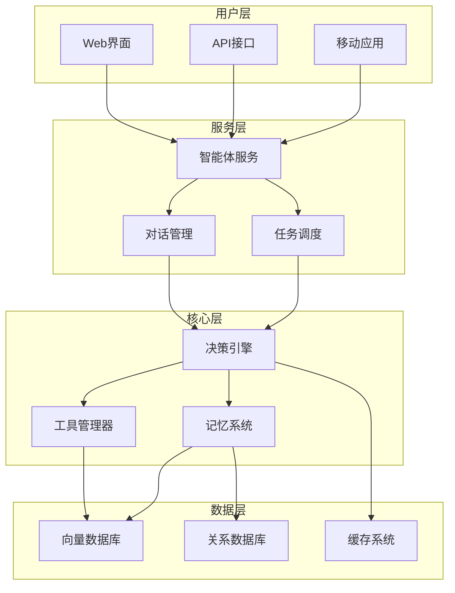

# 架构设计

AI智能体系统的架构设计原则和最佳实践。

## 系统架构概览

## 核心组件

### 1. 智能体引擎
负责智能体的核心逻辑处理。

### 2. 工具系统
提供外部能力扩展。

### 3. 记忆管理
维护对话历史和知识存储。

### 4. 安全模块
确保系统安全运行。

## 设计原则

- **模块化设计**：组件间低耦合，高内聚
- **可扩展性**：支持水平和垂直扩展
- **容错性**：具备故障恢复能力
- **性能优化**：响应时间和吞吐量优化