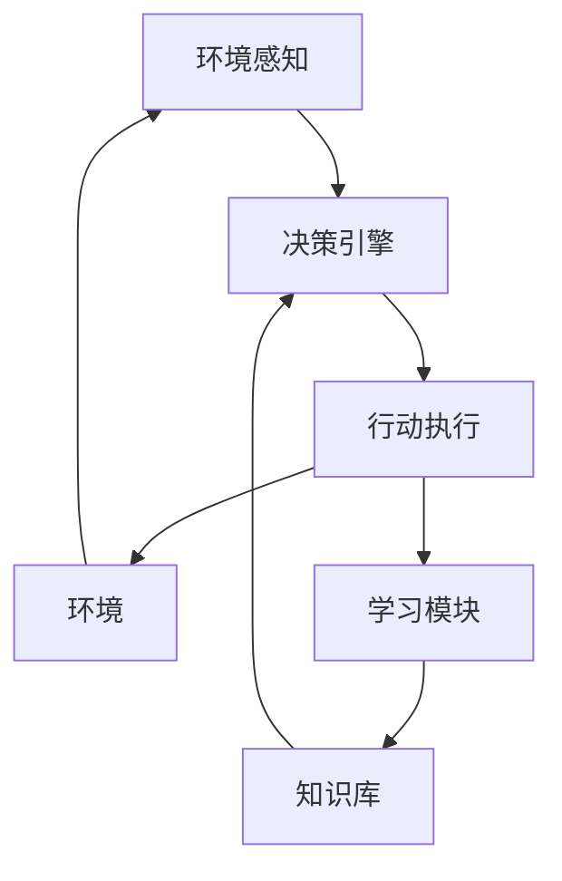

# 核心概念

理解AI智能体的基本概念和工作原理。

## 什么是AI智能体？

AI智能体（AI Agent）是一种能够感知环境、做出决策并执行行动的人工智能系统。它具备以下核心特征：

### 🧠 自主性（Autonomy）
- 能够独立运行，无需持续的人工干预
- 根据目标和环境自主做出决策
- 具备自我管理和错误恢复能力

### 🔄 反应性（Reactivity）
- 能够感知环境变化
- 及时响应外部刺激
- 适应动态变化的情况

### 🎯 目标导向（Goal-oriented）
- 具有明确的目标和任务
- 能够制定和执行计划
- 持续优化以达成目标

### 📚 学习能力（Learning）
- 从经验中学习和改进
- 适应新的情况和需求
- 不断优化性能表现

## 智能体架构

### 基础架构模型



### 组件详解

#### 1. 感知模块（Perception）
负责收集和处理环境信息：

```python
class PerceptionModule:
    def __init__(self):
        self.sensors = {
            'text': TextProcessor(),
            'image': ImageProcessor(),
            'audio': AudioProcessor()
        }
    
    def perceive(self, input_data):
        # 多模态输入处理
        processed_data = {}
        for modality, processor in self.sensors.items():
            if modality in input_data:
                processed_data[modality] = processor.process(
                    input_data[modality]
                )
        return processed_data
```

#### 2. 决策引擎（Decision Engine）
智能体的核心，负责推理和决策：

```python
class DecisionEngine:
    def __init__(self, model, knowledge_base):
        self.model = model
        self.knowledge_base = knowledge_base
        self.reasoning_chain = []
    
    def decide(self, perception_data, goal):
        # 检索相关知识
        relevant_knowledge = self.knowledge_base.query(
            perception_data, goal
        )
        
        # 生成决策
        decision = self.model.generate_decision(
            perception_data, 
            relevant_knowledge, 
            goal
        )
        
        # 记录推理过程
        self.reasoning_chain.append({
            'input': perception_data,
            'knowledge': relevant_knowledge,
            'decision': decision,
            'timestamp': datetime.now()
        })
        
        return decision
```

#### 3. 执行模块（Action Module）
将决策转化为具体行动：

```python
class ActionModule:
    def __init__(self):
        self.tools = {
            'search': WebSearchTool(),
            'calculate': CalculatorTool(),
            'code': CodeExecutorTool(),
            'communicate': CommunicationTool()
        }
    
    def execute(self, decision):
        action_type = decision.get('type')
        action_params = decision.get('parameters')
        
        if action_type in self.tools:
            tool = self.tools[action_type]
            result = tool.execute(action_params)
            return result
        else:
            raise ValueError(f"Unknown action type: {action_type}")
```

## 智能体类型

### 按复杂度分类

#### 1. 简单反射智能体
- 基于条件-行动规则
- 适用于简单、确定性环境
- 响应速度快，但缺乏灵活性

```python
class SimpleReflexAgent:
    def __init__(self, rules):
        self.rules = rules  # 条件-行动规则集
    
    def act(self, perception):
        for condition, action in self.rules:
            if condition(perception):
                return action
        return None  # 默认行动
```

#### 2. 基于模型的智能体
- 维护内部世界模型
- 能够处理部分可观察环境
- 具备一定的预测能力

```python
class ModelBasedAgent:
    def __init__(self, model, rules):
        self.world_model = model
        self.rules = rules
        self.state = {}
    
    def act(self, perception):
        # 更新世界模型
        self.world_model.update(perception, self.state)
        
        # 基于模型状态决策
        current_state = self.world_model.get_state()
        return self.decide_action(current_state)
```

#### 3. 目标导向智能体
- 具有明确目标
- 能够规划和搜索
- 评估行动的后果

```python
class GoalBasedAgent:
    def __init__(self, goal, planner):
        self.goal = goal
        self.planner = planner
        self.current_plan = []
    
    def act(self, perception):
        if not self.current_plan or self.need_replan(perception):
            self.current_plan = self.planner.plan(
                current_state=perception,
                goal=self.goal
            )
        
        if self.current_plan:
            return self.current_plan.pop(0)
        return None
```

#### 4. 效用导向智能体
- 考虑行动的效用和成本
- 能够在多个目标间权衡
- 追求整体效用最大化

```python
class UtilityBasedAgent:
    def __init__(self, utility_function):
        self.utility_function = utility_function
    
    def act(self, perception):
        possible_actions = self.get_possible_actions(perception)
        best_action = None
        best_utility = float('-inf')
        
        for action in possible_actions:
            expected_utility = self.calculate_expected_utility(
                action, perception
            )
            if expected_utility > best_utility:
                best_utility = expected_utility
                best_action = action
        
        return best_action
```

### 按应用领域分类

#### 1. 对话智能体
专注于自然语言交互：

```python
class ConversationalAgent:
    def __init__(self, language_model, personality):
        self.language_model = language_model
        self.personality = personality
        self.conversation_history = []
    
    def chat(self, user_input):
        # 更新对话历史
        self.conversation_history.append({
            'role': 'user',
            'content': user_input
        })
        
        # 生成回复
        response = self.language_model.generate(
            context=self.conversation_history,
            personality=self.personality
        )
        
        self.conversation_history.append({
            'role': 'assistant',
            'content': response
        })
        
        return response
```

#### 2. 任务执行智能体
专注于完成特定任务：

```python
class TaskExecutionAgent:
    def __init__(self, task_planner, tool_kit):
        self.task_planner = task_planner
        self.tool_kit = tool_kit
    
    def execute_task(self, task_description):
        # 分解任务
        subtasks = self.task_planner.decompose(task_description)
        
        results = []
        for subtask in subtasks:
            # 选择合适的工具
            tool = self.tool_kit.select_tool(subtask)
            
            # 执行子任务
            result = tool.execute(subtask)
            results.append(result)
        
        # 整合结果
        return self.integrate_results(results)
```

## 关键技术

### 1. 大语言模型（LLM）
现代智能体的核心技术：

- **文本理解**：理解自然语言指令和上下文
- **推理能力**：进行逻辑推理和问题解决
- **知识整合**：整合训练数据中的知识
- **代码生成**：生成和执行代码

### 2. 检索增强生成（RAG）
增强智能体的知识获取能力：

```python
class RAGSystem:
    def __init__(self, vector_db, embedding_model):
        self.vector_db = vector_db
        self.embedding_model = embedding_model
    
    def retrieve_and_generate(self, query, generator):
        # 检索相关文档
        query_embedding = self.embedding_model.encode(query)
        relevant_docs = self.vector_db.similarity_search(
            query_embedding, top_k=5
        )
        
        # 构建增强上下文
        context = "\n".join([doc.content for doc in relevant_docs])
        
        # 生成回答
        response = generator.generate(
            query=query,
            context=context
        )
        
        return response, relevant_docs
```

### 3. 工具使用（Tool Use）
扩展智能体的能力边界：

```python
class ToolManager:
    def __init__(self):
        self.tools = {}
        self.tool_descriptions = {}
    
    def register_tool(self, name, tool, description):
        self.tools[name] = tool
        self.tool_descriptions[name] = description
    
    def select_tool(self, task_description):
        # 基于任务描述选择最合适的工具
        tool_scores = {}
        for name, desc in self.tool_descriptions.items():
            score = self.calculate_relevance(task_description, desc)
            tool_scores[name] = score
        
        best_tool = max(tool_scores, key=tool_scores.get)
        return self.tools[best_tool]
```

### 4. 记忆系统
维护长期和短期记忆：

```python
class MemorySystem:
    def __init__(self):
        self.short_term = deque(maxlen=10)  # 最近10轮对话
        self.long_term = VectorDatabase()   # 长期记忆向量库
        self.episodic = []                  # 情节记忆
    
    def store_interaction(self, interaction):
        # 存储到短期记忆
        self.short_term.append(interaction)
        
        # 重要交互存储到长期记忆
        if self.is_important(interaction):
            self.long_term.store(interaction)
        
        # 记录情节
        self.episodic.append({
            'timestamp': datetime.now(),
            'interaction': interaction,
            'context': self.get_current_context()
        })
    
    def retrieve_relevant_memories(self, query):
        # 从长期记忆检索相关内容
        relevant_memories = self.long_term.search(query)
        
        # 结合短期记忆
        recent_context = list(self.short_term)
        
        return {
            'recent': recent_context,
            'relevant': relevant_memories
        }
```

## 评估指标

### 性能指标

#### 1. 任务完成率
```python
def calculate_task_completion_rate(completed_tasks, total_tasks):
    return completed_tasks / total_tasks * 100
```

#### 2. 响应准确性
```python
def calculate_accuracy(correct_responses, total_responses):
    return correct_responses / total_responses * 100
```

#### 3. 响应时间
```python
def measure_response_time(start_time, end_time):
    return end_time - start_time
```

### 用户体验指标

#### 1. 用户满意度
- 通过用户反馈收集
- 使用评分系统（1-5分）
- 定期进行用户调研

#### 2. 对话质量
- 对话连贯性
- 信息准确性
- 回答相关性

#### 3. 系统可用性
- 系统稳定性
- 错误恢复能力
- 用户界面友好性

## 发展趋势

### 1. 多模态智能体
- 文本、图像、音频的统一处理
- 跨模态理解和生成
- 更自然的人机交互

### 2. 自主学习智能体
- 在线学习和适应
- 个性化定制
- 持续改进能力

### 3. 协作智能体
- 多智能体系统
- 分工协作
- 集体智能

### 4. 具身智能体
- 物理世界交互
- 机器人控制
- 现实环境适应

## 小结

AI智能体是一个快速发展的领域，理解其核心概念对于开发和应用智能体系统至关重要。随着技术的不断进步，智能体将变得更加智能、自主和有用。

下一步，你可以：
- [学习如何创建智能体](./create.md)
- [了解架构设计原则](./architecture.md)
- [查看实际应用示例](../examples/)