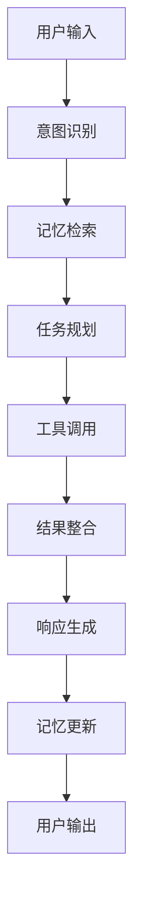

# AI智能体指南

欢迎来到AI智能体的世界！这里是您探索人工智能代理技术的起点。

## 什么是AI智能体？

AI智能体是一种能够感知环境、做出决策并执行行动的人工智能系统。它们具备以下核心能力：

- 🧠 **智能理解** - 深度理解自然语言和复杂指令
- 💭 **记忆管理** - 维护长期和短期记忆，支持上下文感知
- 🛠️ **工具使用** - 集成各种API和服务，扩展功能边界
- 🎯 **任务执行** - 自主规划和执行复杂的多步骤任务
- 🤝 **自然交互** - 与用户进行流畅、自然的对话交互

## 智能体类型

根据应用场景，我们提供多种智能体模板：

### 🤖 对话型智能体
专注于自然语言交互，适用于客服、咨询、教育等场景
- [客户服务智能体](./templates/customer-service.md)

### 🔧 工具型智能体  
集成各种工具和API，执行具体任务
- [代码助手智能体](./templates/code-assistant.md)

### ✍️ 创作型智能体
专注于内容生成和创意工作
- [内容创作智能体](./templates/content-creator.md)

## 核心架构

了解AI智能体的技术架构：

## 快速开始

### 1. 选择智能体模板
根据您的需求选择合适的智能体模板

### 2. 配置参数
设置智能体的基本参数和行为规则

### 3. 集成工具
添加所需的工具和API集成

### 4. 测试部署
在开发环境中测试，然后部署到生产环境

## 学习路径

### 🌟 初学者
- [基本概念](./concepts.md) - 了解AI智能体的基础知识
- [快速创建](./create.md) - 创建您的第一个智能体
- [基础配置](./config.md) - 学习基本配置选项

### 🚀 进阶用户
- [架构设计](./architecture.md) - 深入理解系统架构
- [记忆系统](./memory.md) - 掌握记忆管理机制
- [工具集成](./tools.md) - 学习工具开发和集成

### 🎯 专家级
- [监控调试](./monitoring.md) - 生产环境监控
- [部署运维](./deploy.md) - 大规模部署策略

## 最佳实践

### 设计原则
- **用户中心** - 始终以用户需求为核心
- **渐进增强** - 从简单功能开始，逐步增加复杂性
- **可观测性** - 确保系统行为可监控和调试
- **安全第一** - 在设计阶段就考虑安全因素

### 开发建议
- 使用版本控制管理智能体配置
- 建立完善的测试体系
- 实施持续集成和部署
- 定期评估和优化性能

## 社区资源

- 📚 [示例库](../examples/) - 丰富的代码示例和用例
- 🔧 [工具集](./tools.md) - 常用工具和插件
- 📖 [API文档](../api-reference.md) - 完整的API参考
- ❓ [常见问题](../faq.md) - 常见问题解答